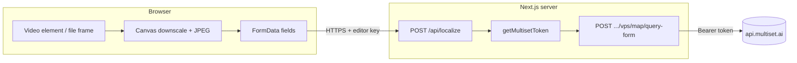

# Multiset map query (REST) — architecture & reference

**Last updated:** 2026-05-09  

This document describes how this sample uses **Multiset’s VPS REST APIs** for localization (map query) with **camera frames** or **offline video frames**, without the WebXR NPM SDK. It is meant to stay in sync with implementation details you need for scripts (resolution, intrinsics, endpoints, coordinates).

**Official docs:** [Map query (REST)](https://docs.multiset.ai/basics/rest-api-docs/map-query)

---

## Goals and scope

| In scope | Out of scope (see Multiset docs) |
|----------|-----------------------------------|
| Single-image **form-data** query (`query-form`) via our **server proxy** | Raw browser → `api.multiset.ai` with client secret (never ship secrets to the client) |
| Max **1280 px** long edge, JPEG encoding, intrinsics matching the encoded image | Multi-image query API (4–6 images + SLAM poses) — summarized below for reference only |
| **Auth:** M2M bearer token on the server | Geo / floor hints (`hintPosition`, `hintFloorHeight`) — supported by API; wire when needed |

---

## High-level architecture



1. **Browser** captures a **single frame** (live `getUserMedia` or, in your script, a decoded video frame) as **JPEG**.
2. Browser builds **multipart FormData** with **map code**, **pinhole intrinsics**, **width/height** of the **encoded** image, **`isRightHanded`**, and the **image file** (field name `queryImage` in our proxy).
3. **`POST /api/localize`** (this repo) attaches the **Multiset M2M token** and forwards the body to **`https://api.multiset.ai/v1/vps/map/query-form`**.
4. Response JSON is the **localization result** (`poseFound`, `position`, `rotation`, `confidence`, etc.).

**Why a server route?**  
`MULTISET_CLIENT_ID` / `MULTISET_CLIENT_SECRET` must stay **server-only**. The browser never holds the Multiset secret.

**Editor protection:**  
`apiFetch` sends `x-editor-key` when `NEXT_PUBLIC_EDITOR_SHARED_KEY` is set. **`/api/localize` currently does not verify that header** (unlike some other routes)—add a guard if you expose this app on the public internet.

---

## Endpoints used in this repo

| Role | URL | Method |
|------|-----|--------|
| M2M token | `https://api.multiset.ai/v1/m2m/token` | `POST`, body `{}`, `Authorization: Basic base64(clientId:clientSecret)` |
| Map query (form) | `https://api.multiset.ai/v1/vps/map/query-form` | `POST`, `Authorization: Bearer <token>`, body `multipart/form-data` |

Implementation: `src/lib/server/multisetToken.ts`, `src/app/api/localize/route.ts`.

---

## Query image: format, resolution, color

| Requirement | Detail |
|-------------|--------|
| **Encoding** | **JPEG** (this sample: `image/jpeg` from canvas `toBlob`). |
| **Max resolution** | **Neither width nor height may exceed 1280 px** per Multiset documentation. |
| **Downscaling** | If the source is larger, scale uniformly so `max(width,height) ≤ 1280` **before** upload. |
| **Aspect** | Preserve aspect ratio; intrinsics must match the **final** pixel width/height. |
| **Color** | Standard 8-bit color; avoid extreme compression that wipes texture detail. |
| **Quality (this app)** | `QUERY_JPEG_QUALITY ≈ 0.82` in `src/lib/ar/webcamCapture.ts` (tunable). |

**Video / script workflow:** extract frames (e.g. ffmpeg), resize so long edge ≤ 1280, export JPEG, then either:

- call **`/api/localize`** with **multipart** the same as the browser, or  
- call **`/api/localize`** with **JSON** + **base64 data URL** (see route handler) from a trusted server-side script.

---

## Camera intrinsics (fx, fy, px, py) and `width` / `height`

Multiset expects **pinhole camera parameters in pixel units** for the **same** `width` × `height` as the query image.

### Field meanings (typical)

- **`fx`, `fy`**: focal lengths in **pixels** (two values allow non-square pixels; we often derive both from one vertical FOV assumption).
- **`px`, `py`**: principal point (usually near **width/2**, **height/2** for centered cameras).
- **`width`, `height`**: dimensions of the **encoded** query image (after downscale).

### What this sample does (webcam)

In **`src/lib/ar/webcamCapture.ts`**:

- Downscale the frame so **max dimension ≤ 1280**.
- Assume a **configurable vertical FOV** (default **60°**), set via `NEXT_PUBLIC_CAMERA_VERTICAL_FOV` if needed.
- Compute:

  \[
  f_y = \frac{h}{2 \tan(\mathrm{vFOV}/2)}, \quad
  f_x = f_y \cdot \frac{w}{h}, \quad
  p_x = w/2, \quad p_y = h/2
  \]

This is an **engineering estimate**, not a physical calibration. For production or tight alignment with a 3D map, **calibrate** the camera or read intrinsics from **ARCore / ARKit** if available.

### If you resize an image after capture

Multiply **`fx`, `fy`, `px`, `py`** by the **uniform scale factor** \(s\) from original → resized (same as we did for WebXR in `xrCapture.ts`). **Always** tie intrinsics to the **JPEG you send**.

### WebXR / `camera-access` (optional legacy path)

`src/lib/ar/xrCapture.ts` still contains helpers to derive intrinsics from **WebXR projection matrix** and **`readPixels`** from the XR camera texture. That path is **not** used by the current AR page but is useful if you resume immersive capture.

---

## Handedness: `isRightHanded`

Sent as **`isRightHanded`** on the form (string `"true"` / `"false"`).

- This sample defaults to **`true`**, aligned with Multiset’s Web/SDK convention for **form** queries (see historical use of `@multisetai/vps` andMultiset samples).
- Set **`NEXT_PUBLIC_VPS_IS_RIGHT_HANDED=false`** in the browser build if your pipeline assumes **LHS (Unity)** for incoming/outgoing poses ([Multiset hint docs](https://docs.multiset.ai/basics/rest-api-docs/map-query) → `hintPosition`).

**Multiset documentation note:** `hintPosition` is described in **LHS** under the documented conventions; always cross-check your **Three.js / glTF** vs **Unity** conversion when placing content.

Reference: [Map query](https://docs.multiset.ai/basics/rest-api-docs/map-query) and related hint pages linked there.

---

## Our Next.js proxy: `POST /api/localize`

**File:** `src/app/api/localize/route.ts`

### Multipart (browser)

Same fields the upstream form API expects; **do not** set `Content-Type` manually—`fetch` sets the boundary.

Typical fields appended in the client:

- `mapCode`
- `fx`, `fy`, `px`, `py`
- `width`, `height`
- `isRightHanded`
- `queryImage` — **File** / `Blob` (filename e.g. `query.jpg`)

### JSON (scripts / tools)

Supported for convenience:

```json
{
  "mapCode": "MAP_XXXXX",
  "cameraIntrinsics": { "fx": 1000, "fy": 1000, "px": 640, "py": 360 },
  "resolution": { "width": 1280, "height": 720 },
  "isRightHanded": true,
  "queryImage": "data:image/jpeg;base64,..."
}
```

The route **repacks** this into **`FormData`** for `query-form`. **Do not** hand-set `multipart` Content-Type on the client.

---

## AR page behavior (browser)

**File:** `src/app/ar/[projectId]/page.tsx`

- Loads **project** → **`map_code`**, placements, asset URLs from this app’s APIs.
- **`getUserMedia`** with `facingMode: ideal "environment"` (rear camera on phones).
- On **Localize**, grabs one video frame → downscale → JPEG → **`/api/localize`**.
- After a **`poseFound`** result, **`ArPlacementOverlay`** (`src/components/ArPlacementOverlay.tsx`) draws placement GLBs in **map coordinates** using a Three.js camera at the localized **position/quaternion** (`buildMapCameraMatrix` in `src/lib/ar/mapPose.ts`). The canvas is **transparent** over the live video preview.
- **Important (R3F):** do not pass a `camera={{ position: … }}` object to `<Canvas>` while also setting the camera from localization — React Three Fiber reapplies that prop on parent re-renders and **was resetting the pose every frame**, making content look **stuck to the screen / camera**. Pose is synced with **`useFrame`**, and FOV is initialized in `onCreated`.
- **Alignment:** `NEXT_PUBLIC_AR_LOCALIZE_POSE_MODE` selects `direct` (default, same frame as raw API + editor mesh) vs `unity` / `invMapCam` / etc. if your map uses different handedness.
- This is still a **single-frame snapshot**: rotating the physical phone does **not** update the overlay until you **Localize** again — there is no continuous SLAM in REST-only mode. True “sticky” AR needs WebXR/ARKit style tracking plus repeated queries or fusion.

---

## Editor: Multiset map mesh and CORS

**Symptom:** Opening the editor failed to load `TexturedMesh.glb` / `THREE.WebGLRenderer: Context Lost` after the browser logged **CORS** errors for `prod-multiset.s3-accelerate.amazonaws.com`.

**Cause:** The editor receives a **short-lived presigned S3 URL** from Multiset (`/api/maps/.../download-mesh-url`). The bucket does not send **`Access-Control-Allow-Origin`** for arbitrary web origins (e.g. Netlify), so **`useGLTF` / `fetch` from the browser is blocked**.

**Fix:** Load the mesh via a **same-origin proxy** instead of the naked S3 URL:

- **`GET /api/maps/[mapCode]/mesh`** — Next.js downloads the blob using the fresh presigned URL **on the server** and returns **`model/gltf-binary`** to the browser.
- The editor passes `apiUrl(\`/api/maps/${mapCode}/mesh\`)` into `EditorCanvas`.

**Files:** `src/app/api/maps/[mapCode]/mesh/route.ts`, `src/app/editor/[projectId]/page.tsx`

---

## Multi-image query API (reference only)

Multiset also exposes **`/vps/map/multi-image-query`**: **4–6** images per request with **per-image SLAM pose** (`imageN_data`). This sample **does not** implement it end-to-end; use the official OpenAPI YAML from the [map query docs](https://docs.multiset.ai/basics/rest-api-docs/map-query) when you need temporal robustness from a moving camera.

---

## Environment variables (relevant)

| Variable | Role |
|----------|------|
| `MULTISET_CLIENT_ID`, `MULTISET_CLIENT_SECRET` | Server M2M auth (required for `/api/localize`) |
| `NEXT_PUBLIC_EDITOR_SHARED_KEY` | Sent as `x-editor-key` from the browser |
| `NEXT_PUBLIC_CAMERA_VERTICAL_FOV` | Override default **60** (degrees) for estimated intrinsics |
| `NEXT_PUBLIC_VPS_IS_RIGHT_HANDED` | Set `false` to send `isRightHanded=false` from the AR page |

---

## Operational checklist for your video script

1. **Decode** frames at native or high resolution; **resize** so max side **≤ 1280**.
2. **Encode JPEG** (reasonable quality, not tiny).
3. Compute **intrinsics for the resized image** (calibrated preferred; else FOV model as above).
4. **POST** to your deployment’s **`/api/localize`** with the same multipart field names as the browser (or JSON + data URL).
5. Parse **`poseFound`**; if false, log `confidence` if present and try adjacent frames / exposure.
6. Optional: add **`hintPosition`** / **`hintRadius`** / **`hintFloorHeight`** when you have a pose prior (form fields as JSON strings per Multiset docs).

---

## Changelog (keep appending)

| Date | Change |
|------|--------|
| 2026-05-07 | AR page switched from `@multisetai/vps` WebXR to **REST** + webcam; added `webcamCapture.ts` and this document. |
| 2026-05-07 | JSON body path for `/api/localize`: `isRightHanded` default changed to **`true`** (omit field to match browser defaults). |
| 2026-05-09 | **`GET .../mesh`**: proxy Multiset map GLB for editor (**CORS**). **AR overlay:** `ArPlacementOverlay` shows placements after REST localize (**snapshot**, not persistent AR). |
| 2026-05-09 | **AR overlay pose bugfix:** avoid R3F `camera` prop reset; apply localized camera in **`useFrame`**; optional `NEXT_PUBLIC_AR_LOCALIZE_POSE_MODE`. |
